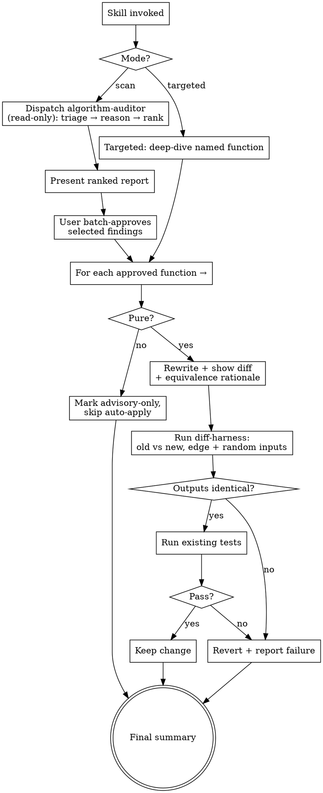

# Design: `optimize-algorithms` skill

**Date:** 2026-06-23
**Status:** Approved (design phase) — pending implementation plan

## Summary

A single Claude Code skill, `optimize-algorithms`, that finds and safely applies
algorithmic optimizations to **custom, pure functions** — replacing suboptimal
time/space complexity (nested loops, wrong data structures, un-memoized recursion,
etc.) with better algorithms and data structures.

It works in two modes — **scan** a codebase/directory, or **diagnose a specific
function/flow** named by the user — and never rewrites code without first
presenting its idea and getting approval. Every applied change is proven behavior-
preserving by a differential equivalence harness before it is kept.

The skill is **TS/JS-first** but designed so the heuristics, strategy playbook,
and workflow are language-agnostic, with a clear extension point for adding more
language runners later.

## Goals

- Surface genuine algorithmic improvements, not stylistic noise.
- Never silently change behavior — equivalence is proven, not assumed.
- Keep the approval gate structural (impossible to bypass).
- Be honest about confidence, impact, and the limits of verification.

## Non-goals

- Optimizing library/framework code (only "custom pure" functions).
- Micro-optimizations with no complexity change and no measured benefit.
- Rewriting impure functions automatically (they are surfaced as advisory-only).
- Formal/exhaustive verification (the harness is high-coverage fuzzing, not a proof).
- Multi-language execution in v1 (design supports it; only TS/JS is implemented).

## Architecture

One skill bundling one read-only subagent.

```
optimize-algorithms/
├── SKILL.md                  # workflow orchestration (the brain)
├── agents/
│   └── algorithm-auditor.md  # read-only scanner: triage + reason + rank
├── references/
│   ├── heuristics.md         # suspect-pattern catalog
│   ├── strategies.md         # algorithm/data-structure playbook
│   └── report-format.md      # ranked-report schema
└── scripts/
    └── diff-harness.ts       # TS/JS differential equivalence runner
```

**Separation of responsibility:**
- The **`algorithm-auditor`** subagent is **read-only** (no Edit/Write). It only
  diagnoses and produces the ranked report.
- The **skill main loop** owns all rewriting and verification. Because the auditor
  cannot write, the approval gate can never be bypassed.

### Entry modes

- **Scan mode** ("audit this repo/dir"): skill dispatches `algorithm-auditor`,
  which returns a ranked report. User batch-approves selected findings; the skill
  then works through them one function at a time.
- **Targeted mode** ("optimize this function/flow"): skips the broad scan and goes
  straight to deep-dive on the named target, then the same apply-and-verify path.

## Detection: heuristics + reasoning

Two passes, cheap to expensive.

### Pass A — heuristic triage (pattern-based, flags suspects only)

| Pattern | Smell | Likely fix |
|---|---|---|
| Nested loop over same/related data | O(n²) | hash map / set join |
| `.includes` / `.indexOf` / `.find` inside a loop | O(n²) membership | `Set`/`Map` lookup → O(1) |
| `.sort()` inside a loop, or repeated re-sort | O(n² log n) | sort once outside |
| Array used as set/dict (linear scans) | wrong structure | `Set` / `Map` |
| Recursion with overlapping subproblems, no memo | exponential | memoization / DP |
| Repeated linear scan for min/max / top-k | O(n·k) | heap |
| Linear search over a sorted array | O(n) | binary search |
| Repeated string/array concat in loop | O(n²) | accumulate + join |
| Recompute of loop-invariant work | wasted work | hoist out of loop |

The catalog lives in `references/heuristics.md` so patterns can be added without
touching the agent prompt.

### Pass B — LLM reasoning on each suspect

Confirm the real time/space complexity, infer intent, and judge whether a better
strategy genuinely applies — including whether input sizes make it worth it
(n=5 nested loops are not a bug). Heuristics propose; reasoning disposes, killing
false positives.

## Strategy playbook (`references/strategies.md`)

For each strategy: when it applies, the smell it replaces, the complexity win, a
TS before/after sketch, and a **"don't bother when"** note (small n, not hot,
readability cost > gain).

| Strategy | Replaces | Win |
|---|---|---|
| Hash map / Set lookup | linear scan / nested membership | O(n²)→O(n) |
| Sort once + two-pointer / binary search | repeated scans, search in sorted data | O(n²)→O(n log n), O(n)→O(log n) |
| Heap (priority queue) | repeated min/max, top-k | O(n·k)→O(n log k) |
| Memoization / tabulation (DP) | overlapping-subproblem recursion | exp→polynomial |
| Prefix sums / sliding window | repeated range/subarray recompute | O(n²)→O(n) |
| BFS / DFS + adjacency structure | ad-hoc traversal, reachability | clarity + O(V+E) |
| Stack / queue | manual index juggling, recursion-to-iteration | clarity, avoids stack overflow |
| Counting / bucketing | sort when keys are bounded | O(n log n)→O(n) |

## Report format (`references/report-format.md`)

Each finding:

```
#<rank> · <file>:<line> · <functionName>
  Pure: yes | no (→ advisory-only if no)
  Current:   O(n²) time / O(1) space  — <one-line why>
  Proposed:  Set-based lookup → O(n) time / O(n) space
  Strategy:  hash-map-lookup
  Impact:    High   Confidence: High   Effort: Low
  Risk/notes: <e.g. trades memory for speed; n typically large here>
```

**Ranking:** Impact × Confidence, with pure functions surfaced above
advisory-only (impure) ones.

## End-to-end workflow



### Approval model

- **Structural gate:** the auditor cannot write; only the main loop applies, and
  only after the user batch-approves selected findings. This satisfies the
  "present the idea before committing it" requirement.
- **Per-function safety under batch approval:** each approved function independently
  runs the full harness → existing-tests gate. One failure reverts *that* function
  and continues — it never aborts the batch or leaves a half-applied broken change.

### Purity gate

The differential safety net only works for pure functions, so **purity is a
precondition for auto-applying.** Functions with side effects (I/O, shared-state
mutation, randomness, time) are surfaced in the report as **advisory-only** with a
caution — recommended but not rewritten automatically.

## Correctness verification: the differential harness (`scripts/diff-harness.ts`)

The safety net that proves `old ≡ new` for a TS/JS pure function.

**Mechanism:**
1. Extract both implementations into an isolated module — `oldFn` (original,
   preserved before edit) and `newFn` (proposed). Pure functions lift out cleanly.
2. Generate inputs from the function's parameter types (TS type info) plus a fixed
   **edge-case battery**: empty, single-element, duplicates, already-sorted /
   reverse-sorted, negatives/zero, large-n, boundary values, and (for strings)
   empty/unicode.
3. Run both on every input; deep-equal the results. Where relevant, assert `oldFn`
   did not mutate its arguments (purity sanity check).
4. **Seeded** randomness for reproducibility; on failure, report the first divergent
   input verbatim.

**Runner:** `node` with native TS type-stripping (or `tsx` fallback) — no build step.

Then run the project's existing test suite as a second gate.

**Honest limits:**
- Input generation is best-effort high-coverage fuzzing, **not** formal verification.
  The skill states the input count/coverage in its rationale.
- Floating-point comparisons use an epsilon, flagged when used.
- Non-extractable functions (closures over module state, generics the generator
  can't synthesize) → harness reports "couldn't isolate," and that finding
  **downgrades to advisory-only** rather than guessing.

## Final summary (every run)

The skill ends by reporting, honestly:
- **Applied** — with the equivalence evidence (input count, tests passed).
- **Advisory-only** — impure or non-isolatable; recommendation given, not applied.
- **Failed/reverted** — with the failing input or failing test.

## Language extension point (future)

The heuristics, strategy playbook, report format, and workflow are language-neutral.
Adding a language means providing: (1) a heuristic pattern set, (2) a runner that
can isolate a function and execute old-vs-new, and (3) a type-aware input generator.
Only the TS/JS runner ships in v1.

## Open questions for implementation

- Exact TS type → input-generator coverage (which type constructs are supported v1
  vs. downgrade-to-advisory).
- How "hot path" / input-size signal is estimated for the Impact score without
  profiling (call-site heuristics, comments, or user hint).
- Concrete heuristic detection mechanics (regex/AST) for Pass A in TS.
